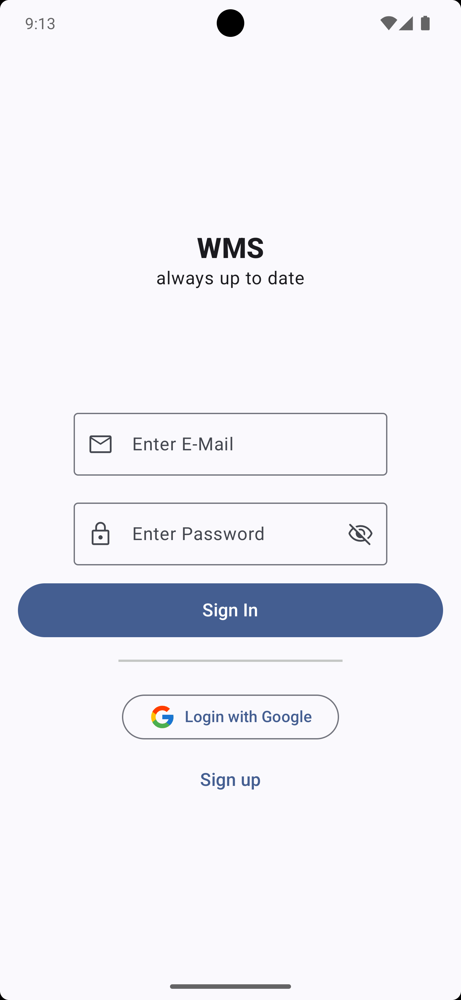
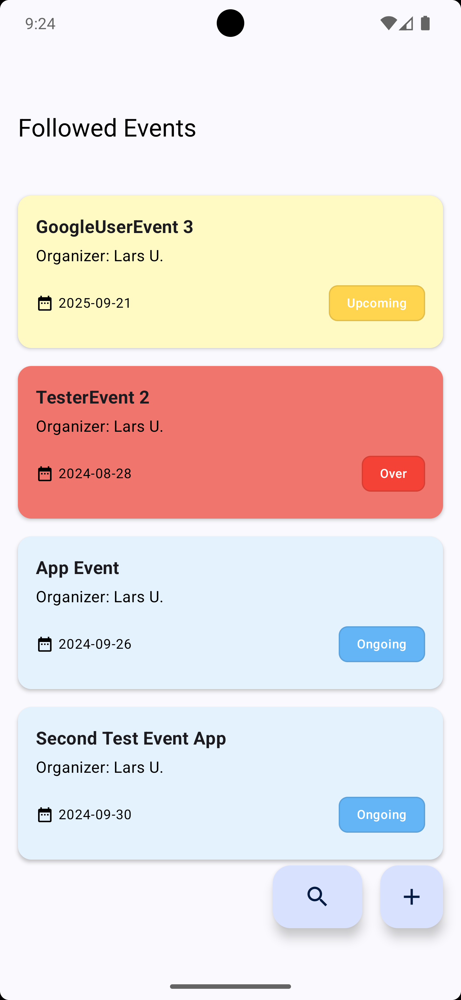
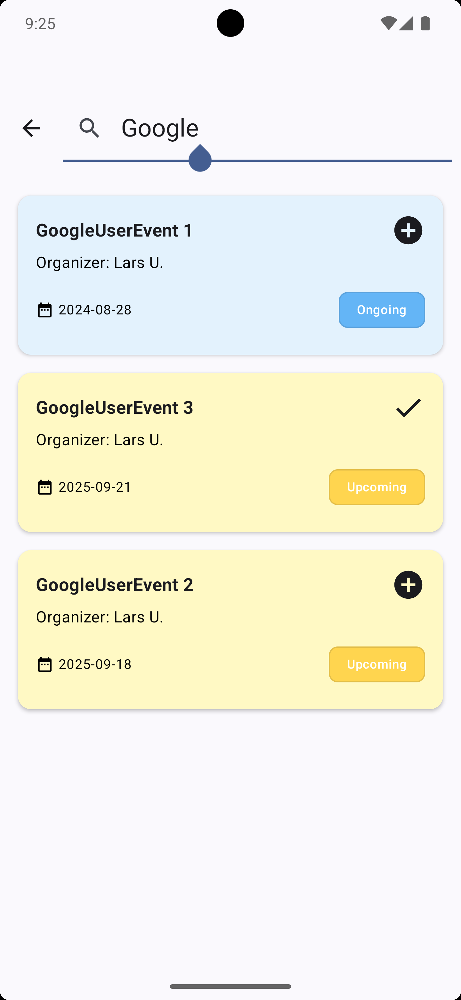

# wms - collaborative event management app

## Status
UNDER DEVELOPMENT!

## Overview
**wms** is a collaborative event management app that helps you stay organized and accountable.

Keeping track of complex events with multiple steps can be challenging. It's difficult to ensure everyone is on the same page and aware of upcoming tasks.
**wms** allows you to create events and break them down into manageable steps. Share your events with others, so they can see all the details, upcoming steps, the current step, and completed steps. This fosters collaboration and ensures everyone stays informed.

## Features

- **Kotlin**
- **Jetpack Compose**
- **Multi-Modular Structure**
- **MVVM Architecture**
- **Coroutines & Flow**
- **Koin**
- **Ktor**
- **Supabase**

## Screenshots
    
